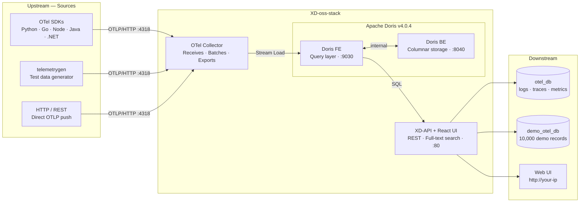

<div align="center">


<h1>XD-oss-stack</h1>

<p><strong>Self-hosted observability stack — ingest, store and explore your data at scale</strong></p>

<p>
  
  
  
  
  
  
</p>

<br/>

> **One command. Full observability stack. No cloud required.**

<br/>

</div>

---

## What is XD-oss-stack?

**XD-oss-stack** is a self-hosted, Docker-based observability platform built for teams who want **full control** over their telemetry data — no vendor lock-in, no per-seat pricing, no data leaving your infrastructure.

| | |
|---|---|
| **Ingest** | Receive logs from any service via OpenTelemetry (OTLP/HTTP) |
| **Store** | Apache Doris — a high-performance analytical database built for logs at scale |
| **Explore** | Web UI with full-text search, filtering, and real-time querying |
| **Deploy** | 4 Docker containers, one install command, runs anywhere |

---

## Architecture



### Databases

| Database | Tables | Purpose |
|----------|--------|---------|
| `otel_db` | `otel_logs`, `otel_traces`, `otel_metrics` | Live telemetry from OTel Collector |
| `demo_otel_db` | `otel_logs` | Pre-seeded demo data (10,000 records) |

---

## Quick Install

### Prerequisites

| OS | Requirements |
|----|-------------|
| Linux | Nothing — Docker auto-installed if missing |
| macOS | Docker Desktop running |
| Windows | Docker Desktop + WSL2 running |

### Linux / macOS

```bash
bash -c "$(curl -fsSL https://raw.githubusercontent.com/xplurdata/oss-stack/main/install.sh)"
```

### What happens during install

```
  ╔═══════════════════════════════════════════════════════╗
  ║          XD-oss-stack Installer v1.0.0               ║
  ╚═══════════════════════════════════════════════════════╝

  ▶  Checking system requirements
  ✓  CPU: 8 cores          ✓  RAM: 16 GB
  ✓  Disk: 120 GB free     ✓  Ports: 80, 4318 available

  ▶  Pulling Docker images
  ✓  All images downloaded

  ▶  Starting containers
  ℹ  This may take up to 10 minutes on first run while Doris initializes.
  ✓  All containers started

  ▶  Waiting for services
  ✓  Doris Frontend         healthy (67s)
  ✓  Doris Backend          healthy (102s)
  ✓  Application            healthy (198s)
  ✓  OTel Collector         healthy (201s)

  ╔═══════════════════════════════════════════════════════╗
  ║   ✓  Installation Complete!                          ║
  ║      Happy Xploring your data!                       ║
  ╚═══════════════════════════════════════════════════════╝
```

---

## Access

After install (~3-5 minutes on first boot):

| Service | URL | Credentials |
|---------|-----|-------------|
| Web UI | `http://<your-ip>` | `admin` / `admin` |
| OTLP HTTP | `http://<your-ip>:4318` | — |

---

## Sending Logs

### Quick test with telemetrygen

```bash
docker run --rm \
 --network xd-oss-stack_otel-net \
  ghcr.io/open-telemetry/opentelemetry-collector-contrib/telemetrygen:latest \
  logs \
  --otlp-endpoint otel-collector:4318 \
  --otlp-http \
  --otlp-insecure \
  --duration 10s \
  --rate 100 \
  --service my-service
```

### OpenTelemetry Python SDK

```bash
pip install opentelemetry-api opentelemetry-sdk opentelemetry-exporter-otlp-proto-http
```

```python
import logging
from opentelemetry._logs import set_logger_provider
from opentelemetry.sdk._logs import LoggerProvider, LoggingHandler
from opentelemetry.sdk._logs.export import BatchLogRecordProcessor
from opentelemetry.exporter.otlp.proto.http._log_exporter import OTLPLogExporter
from opentelemetry.sdk.resources import Resource

resource = Resource.create({"service.name": "my-service", "service.version": "1.0.0"})
lp = LoggerProvider(resource=resource)
lp.add_log_record_processor(
    BatchLogRecordProcessor(
        OTLPLogExporter(endpoint="http://<your-ip>:4318/v1/logs")
    )
)
set_logger_provider(lp)

logger = logging.getLogger("my-service")
logger.addHandler(LoggingHandler(logger_provider=lp))
logger.setLevel(logging.INFO)
logger.info("Hello from my-service!")
```

### Any OTel SDK

Point your OTLP exporter to `http://<your-ip>:4318`

Supported: Go, Java, Node.js, .NET, Python, Ruby, PHP, Rust and more.

---

## Management

```bash
~/xd-oss-stack/manage.sh status       # container status
~/xd-oss-stack/manage.sh logs         # follow app logs
~/xd-oss-stack/manage.sh logs otel-collector
~/xd-oss-stack/manage.sh update       # pull latest images
~/xd-oss-stack/manage.sh restart      # restart all containers
~/xd-oss-stack/manage.sh stop         # stop all containers
~/xd-oss-stack/manage.sh uninstall    # remove everything
```

---

## System Requirements

| Component | Minimum | Recommended |
|-----------|:-------:|:-----------:|
| CPU | 2 cores | 4+ cores |
| RAM | 4 GB | 8 GB |
| Disk | 20 GB | 100 GB |
| Docker | 20.10+ | latest |
| OS | Ubuntu 20.04+ / macOS 12+ / Win 10+ | Ubuntu 22.04 |

> **Low RAM?** No problem. The installer automatically detects available memory and applies reduced JVM settings for machines with less than 8 GB RAM.

---

## Demo Data

On first boot the stack seeds **10,000 realistic log records** across 5 microservices so you can explore immediately:

| Service | Records | Severity |
|---------|---------|---------|
| api-gateway | ~2,000 | 70% INFO · 15% WARN · 15% ERROR |
| auth-service | ~2,000 | 70% INFO · 15% WARN · 15% ERROR |
| payment-service | ~2,000 | 70% INFO · 15% WARN · 15% ERROR |
| notification-service | ~2,000 | 70% INFO · 15% WARN · 15% ERROR |
| inventory-service | ~2,000 | 70% INFO · 15% WARN · 15% ERROR |

---

## Troubleshooting

<details>
<summary>Stack not starting</summary>

```bash
docker logs otel-doris-fe
docker logs otel-doris-be
```
</details>

<details>
<summary>Doris FE fails with "insufficient memory"</summary>

Your machine has less than 8 GB RAM. The installer automatically applies reduced JVM settings. If it still fails:

```bash
free -h  # check available memory
~/xd-oss-stack/manage.sh stop
bash -c "$(curl -fsSL https://raw.githubusercontent.com/xplurdata/oss-stack/main/install.sh)"
```
</details>

<details>
<summary>No data in otel_db.otel_logs</summary>

```bash
docker logs otel-collector
```
</details>

<details>
<summary>App not ready after 5 minutes</summary>

```bash
docker logs -f otel-app
```
</details>

<details>
<summary>Port 80 or 4318 already in use</summary>

```bash
sudo lsof -i :80
sudo lsof -i :4318
```
</details>

<details>
<summary>macOS: process.lock AccessDeniedException</summary>

The installer uses `~/.xd-oss-stack/data` on macOS to avoid bind mount permission issues. If it still fails:

```bash
rm -rf ~/.xd-oss-stack
bash -c "$(curl -fsSL https://raw.githubusercontent.com/xplurdata/oss-stack/main/install.sh)"
```
</details>

<details>
<summary>Full reset (wipes all data)</summary>

```bash
~/xd-oss-stack/manage.sh uninstall
# Then re-run the installer
```
</details>

---

## License

This project is licensed under the **[GNU Affero General Public License v3.0 (AGPL-3.0)](LICENSE)**.

- Free to use, modify and deploy
- Must share modifications under AGPL-3.0
- If offered as a network service, source code must be available
- Cannot be sublicensed or sold as proprietary software

---

<div align="center">

**Built by [Xplurdata](https://github.com/xplurdata) · Explore your data**

[Apache Doris](https://doris.apache.org/) &nbsp;·&nbsp; [OpenTelemetry](https://opentelemetry.io/) &nbsp;·&nbsp; [React](https://react.dev/)

<br/>

⭐ Star this repo if you find it useful!

</div>
